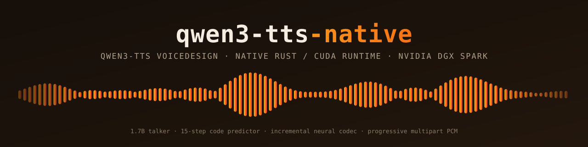

# Qwen3-TTS Native – Rust and CUDA streaming TTS for DGX Spark

[](https://www.rust-lang.org) [](https://developer.nvidia.com/cuda-toolkit) [-1f6feb?style=flat)](docs/PROJECT.md) [](https://github.com/luka-loehr/qwen3-tts-native/releases) [](LICENSE)

**Qwen3-TTS Native** runs [`Qwen/Qwen3-TTS-12Hz-1.7B-VoiceDesign`](https://huggingface.co/Qwen/Qwen3-TTS-12Hz-1.7B-VoiceDesign) entirely in Rust and CUDA, turning text plus a natural-language voice description into progressive 24 kHz PCM. No Python, PyTorch, SGLang, or vLLM at runtime.

---

## Features

- **Fully native pipeline** talker, 15-step code predictor, and neural decoder on custom CUDA kernels and cuBLAS
- **Progressive streaming** multipart PCM before synthesis completes, or buffered WAV
- **Low time to first audio** ~95 ms p95 single-stream vs ~2.7 s for stock SGLang ([benchmarks](docs/BENCHMARKS.md))
- **Small footprint** 5.68 GB peak GPU memory vs 108.90 GB (SGLang keeps better aggregate throughput)
- **Shared warmed engine** bounded concurrency, backpressure, cancellation, and graceful shutdown
- **Ten languages plus Auto** Chinese, English, Japanese, Korean, German, French, Russian, Portuguese, Spanish, Italian
- **Hardened image** non-root `linux/arm64` container with pinned weights, SBOM, and provenance
- **Versioned C ABI** beneath the HTTP service

---

## Quick start

Set `QWEN3_TTS_IMAGE` to the digest-pinned image reference from the [latest release](https://github.com/luka-loehr/qwen3-tts-native/releases/latest), then:

```bash
docker run --rm --gpus device=0 --read-only --cap-drop=ALL \
  --security-opt=no-new-privileges \
  --tmpfs /tmp:rw,noexec,nosuid,nodev,size=64m,uid=10001,gid=10001 \
  -p 127.0.0.1:8080:8080 "$QWEN3_TTS_IMAGE"

curl --fail http://127.0.0.1:8080/health/ready

curl --fail -H 'Content-Type: application/json' -o speech.wav \
  -d '{"text": "Good morning.", "voice_description": "A calm, warm adult male voice.", "language": "english", "stream": false, "output_format": "wav"}' \
  http://127.0.0.1:8080/v1/voice-design/speech
```

> The image targets NVIDIA DGX Spark (GB10, `sm_121`) only. Use the digest from the release notes rather than a tag.

---

## Documentation

- [Project overview](docs/PROJECT.md) – scope, endpoints, build, repository layout, citation
- [Quickstart](docs/QUICKSTART.md) and [HTTP API](docs/API.md) ([OpenAPI](docs/openapi.yaml))
- [Configuration](docs/CONFIGURATION.md), [Operations](docs/OPERATIONS.md), [Architecture](docs/ARCHITECTURE.md)
- [Performance](docs/BENCHMARKS.md) and [benchmark protocol](benchmarks/README.md)
- [Research paper](research/paper/qwen3-tts-native-paper.pdf) and [container build](containers/README.md)

---

## License

Apache License 2.0 - [View License](LICENSE)  
The Qwen3-TTS model is published by the Qwen team under Apache-2.0; model provenance and third-party notices are in [licenses/](licenses/README.md).

---

## Support

- [Report bugs](https://github.com/luka-loehr/qwen3-tts-native/issues)  
- [luka@lukaloehr.com](mailto:luka@lukaloehr.com)  

---

Developed by [Luka Löhr](https://github.com/luka-loehr)
