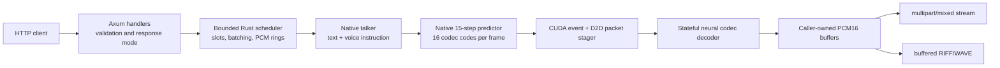

# Architecture

Qwen3-TTS Native is a single-process Rust/CUDA service for
`Qwen/Qwen3-TTS-12Hz-1.7B-VoiceDesign`. It owns the complete online path from
HTTP validation through text-to-code generation and neural codec decoding to
24 kHz mono PCM. Python, Node.js, PyTorch, SGLang, vLLM, TensorRT, and cuDNN are
not in the inference process.

This document describes implemented behavior. In particular, the current CUDA
path uses non-blocking streams, events, custom kernels, and cuBLAS; it does not
capture or execute CUDA Graphs.

## System view

There is one long-lived model engine per process. Immutable talker and decoder
weights are shared. Each admitted request owns independent generation state,
CUDA resources, decoder state, PCM buffers, cancellation state, metrics, and a
scheduler slot.

## Repository components

| Component | Responsibility |
| --- | --- |
| `native/qwen3-tts-server` | Tokio/Axum process, JSON validation, HTTP routing, multipart/WAV encoding, cancellation map, service metrics, readiness, and bounded shutdown. |
| `native/qwen3-tts-runtime` | Fixed-capacity scheduler, request lifecycle, PCM ring ownership, batching, native backend, CUDA packet stager, typed errors, and public C ABI. |
| `native/qwen3-tts-native` | Model/config/tokenizer loading, VoiceDesign prompt construction, shared talker weights, request sessions, talker generation, 15-step code prediction, sampling, and CUDA kernels. |
| `native/qwen3-tts-native-codec` | Shared speech-tokenizer decoder weights and per-request incremental neural codec sessions. |
| `containers/Dockerfile.runtime` | Reproducible ARM64 build, model and metadata verification, minimal CUDA runtime assembly, immutable model packaging, and non-root entrypoint. |

The public C ABI is available for native embedding, but the HTTP server uses
the Rust runtime API directly. No network call exists between the Rust server
and CUDA libraries; native shared libraries are loaded in process.

## Image and artifact boundary

The production image targets only `linux/arm64` and NVIDIA `sm_121`. Both CUDA
shared libraries are compiled as real `sm_121` SASS without a PTX fallback.

At image build time, the separately supplied model context is treated as
read-only. The build:

- checks fixed SHA-256 values for the artifact manifest, VoiceDesign weights,
  and decoder weights;
- runs full native artifact validation;
- copies exactly the VoiceDesign and decoder Safetensors files plus their
  required configuration/tokenizer material;
- excludes the speech-tokenizer encoder, Base/CustomVoice weights, voice-clone
  material, and 0.6B weights; and
- records model identity, revision, and hashes in OCI labels.

At process startup, the talker parses its model config and tokenizer, opens the
VoiceDesign Safetensors arena, verifies the loaded native ABI, uploads shared
weights, and finalizes the model. The codec opens the decoder Safetensors file,
validates its tensor contract, and loads one shared decoder model. The
published image must not be run with a replacement mount over the model root;
that would bypass the identity qualified at build time.

## Startup and warm-up

The main process performs this sequence synchronously before opening a port:

1. Parse the socket address, required paths, device index, and configured
   limits.
2. Validate deployment limits against native ceilings.
3. Load talker and codec shared libraries and weights on one CUDA device.
4. Require compatible device-frame/device-packet capabilities. The production
   libraries use their ABI-v2 device handoff.
5. Construct one fixed-capacity scheduler worker.
6. Start an internal English VoiceDesign request with text `Ready.`, voice
   description `A calm, neutral adult voice.`, and seed `0`.
7. Generate and validate the first one-frame PCM packet. If that packet is not
   terminal, cancel the warm-up request.
8. Require native retirement within five seconds and validate delivery
   metrics.
9. Bind the listener and publish readiness.

Any model, ABI, CUDA, allocation, warm-up, packet, retirement, or metric
failure prevents the listener from binding.

## HTTP admission

For `POST /v1/voice-design/speech`, the server first performs bounded JSON
parsing and semantic validation:

- text and textual voice description;
- case-insensitive supported language;
- JSON-safe seed;
- duration-to-frame conversion;
- sampling ranges and greedy/sample consistency; and
- progressive-PCM versus buffered-WAV mode.

Validation happens before native engine admission. A caller-provided
`x-request-id` is then parsed, or a UUIDv7 is generated. Admission is serialized
against process shutdown so a request is either fully inside the shutdown
boundary with a child cancellation token or rejected as shutting down.

The active-request map prevents simultaneous reuse of a request UUID. Buffered
WAV also acquires a separate bounded egress permit before native start.

## Scheduler

The Rust scheduler has fixed, validated bounds:

- one through six active request slots;
- a synchronous command channel sized from that capacity;
- three reusable PCM buffers per request;
- four codec frames per normal output packet; and
- at most 8,192 codec frames per request.

New requests enter a pending list. Adjacent starts can be coalesced for up to 2
ms, bounded by available request slots. The backend starts each member of that
batch on a scoped native thread. Active requests with an available PCM ring
slot are selected for the next step, and their native steps run on scoped
threads as one bounded batch.

This is bounded concurrency, not an unbounded queue. If all slot permits are
held, engine admission returns capacity exhaustion. A slot is released only
after the native request retires.

### Backpressure

Each request's packet queue and PCM pool share the same fixed ring capacity.
The scheduler generates another packet only when both queue space and a
recycled PCM buffer are available. Dropping an owned packet returns its buffer
to the request pool and wakes the worker.

The first native step requests one codec frame, producing 1,920 samples (80
ms). Later steps request up to four frames, producing at most 7,680 samples
(320 ms). This lowers time to first audio without allowing unbounded small
packets for the remainder.

## Talker and predictor

The request prompt combines UTF-8 text, textual VoiceDesign instruction, and
the selected official language name using the pinned tokenizer and model
configuration. A talker session owns its own CUDA stream, cuBLAS handle,
caches, workspaces, random state, counters, and output events while referencing
shared immutable model weights.

For every codec frame, the talker produces the semantic code and the native
predictor produces the remaining 15 residual codebook values. Sampling state
is request-local and seeded by the effective `seed`. Talker and predictor
sampling settings are distinct; predictor repetition penalty is fixed at 1.0.

Completed session handles can return to the talker session pool after their
request-local state has been reset. A handle is never shared concurrently.

## Device-to-device codec handoff

The production ABI keeps the 16 codec codes per frame on the CUDA device until
the neural decoder has consumed them:

1. The talker exposes a device pointer and records a producer-ready CUDA event.
2. The per-request stager's non-blocking stream waits on that event.
3. It copies 16 unsigned 16-bit codes into the next slot of a 128-byte device
   packet buffer using device-to-device `cudaMemcpyAsync`.
4. The stager records a copied event and returns it to the talker so source
   ownership can be resolved safely.
5. After one to four frames, the codec waits on the packet-ready event and
   snapshots the staged codes on its own stream.
6. The codec records a consumed event. The stager waits on that event before
   reusing the packet buffer.

The event protocol prevents the producer, stager, and decoder from reusing
memory prematurely. A device mismatch, missing event, unsupported ABI pairing,
stale ticket, or failed CUDA operation poisons or fails the request rather than
falling through silently.

The native backend contains a host-code fallback only when both loaded
libraries consistently report that device packets are unsupported. The
production image's paired libraries support the device path; a mixed
capability pair is rejected at startup.

## Stateful neural decoder

The decoder model is shared, while every request owns a codec session with its
own CUDA stream, cuBLAS handle, incremental neural state, and bounded host PCM
staging. It consumes only the newly generated one-to-four-frame packet and
writes the corresponding signed 16-bit mono PCM into a caller-owned buffer.

The scheduler validates every result before publication:

- frame count is in `1..=4`;
- final flag and finish reason agree;
- sample count is exactly `codec_frames * 1920`;
- output stays within the caller-owned PCM capacity; and
- positions remain contiguous across the request.

The server independently revalidates sample rate, channels, frame count,
sample count, byte count, sequence, codec-frame position, sample position, and
the required final packet. An invariant failure cancels and retires the native
request and produces a sanitized internal error.

## HTTP egress

### Progressive PCM

The handler sends a JSON start part into a one-slot Tokio channel, then runs a
blocking polling worker. Each native PCM packet becomes one binary multipart
part. The channel's single-slot capacity propagates a slow consumer back to
the worker; a five-second send timeout cancels the request.

After the final packet, the worker requires native retirement and emits a JSON
end part containing finish reason and request metrics. Cancellation or failure
after HTTP headers produces a terminal JSON error part because the HTTP status
can no longer change. Dropping the body signals cancellation.

### Buffered WAV

The worker accumulates PCM into a vector capped from the configured duration,
requires final packet continuity and native retirement, then encodes one
length-correct RIFF/WAVE body. The HTTP layer emits it in 64 KiB body chunks
while holding the buffered-egress permit. Dropping or consuming the complete
body releases that permit.

## Request lifecycle and failure containment

A request transitions through queued, prefilling, generating, draining, and a
terminal completed/cancelled/failed state. Its handle requests cancellation on
drop. Backend panics are contained at scheduler batch boundaries and converted
into typed failures; scheduler-worker panic cleanup cancels or fails all
remaining active and pending requests.

The server waits up to 25 seconds for native retirement. A timeout marks the
shared engine unhealthy and leaves an explicit request-ID tombstone. Readiness
then returns 503 so the deployment can replace the process. The implementation
does not attempt unsafe in-process recovery of a stuck CUDA session.

SIGINT or SIGTERM closes admission atomically, cancels all child request tokens,
and gives the HTTP server 35 seconds to stop. A watchdog forces an exit if that
deadline is exceeded.

## Memory ownership

| Resource | Ownership |
| --- | --- |
| VoiceDesign weights | One immutable device allocation shared by all talker sessions. |
| Decoder weights | One immutable device allocation shared by all codec sessions. |
| Talker/predictor caches and workspaces | One set per active request/session. |
| Codec state and CUDA resources | One set per active request/session. |
| D2D code staging | One 128-byte device packet buffer per active request. |
| PCM ring | Three buffers per request, each sized for four frames; 46,080 bytes in total. |
| Multipart chunk | One in-flight HTTP channel item per progressive request. |
| Buffered PCM/WAV | One bounded vector and one egress permit per buffered request. |

All request-owned resources are released at retirement. Shared weights remain
resident until process exit.

## Security and trust boundaries

The native engine trusts only validated request structures, paired native
libraries, and the image's pinned model artifact. It does not provide a user or
tenant security boundary. The HTTP listener has no authentication or TLS, and
all endpoints share it.

The production container narrows the process boundary with a non-root UID,
read-only model files, no compiler/interpreter toolchain, a read-only root
filesystem at deployment, no Linux capabilities, no-new-privileges, a bounded
tmpfs, and a PID limit. Network identity, authentication, authorization,
request quotas, and abuse controls belong at the deployment edge.

## Deliberately absent

The current production contract does not include:

- voice cloning, reference audio, named voices, Base, CustomVoice, or 0.6B
  checkpoints;
- Python, Node.js, PyTorch, SGLang, vLLM, TensorRT, cuDNN, or a sidecar model
  server;
- CUDA Graph capture or replay;
- PTX fallback or a portable x86/multi-architecture image;
- multi-GPU sharding or request migration between devices;
- built-in authentication, TLS, persistence, job queues, or tenant isolation;
- server-side latency histograms, GPU telemetry, or energy metrics; or
- a drain endpoint that lets active requests finish after SIGTERM.

These boundaries are intentional. A future implementation must not be
documented as supported until code, contract tests, real-GPU qualification,
and the production image all agree.
